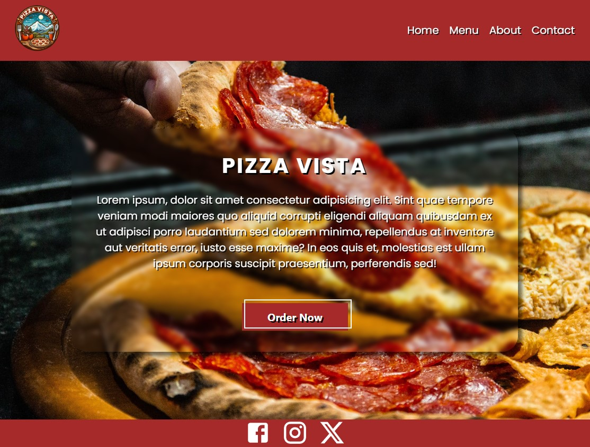
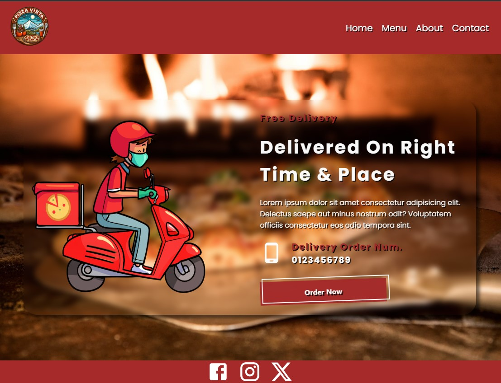

# Pizza Shop WebPage React

## Description

I've created a web application for a pizza shop using React, consisting of four pages.

## Table of Contents

- [Installation](#installation)
- [Usage](#usage)
- [Contributing](#contributing)
- [License](#license)

## Installation

To run the project locally, follow these steps:

1.  Clone the repository to your local machine.

    bashCopy code

    `git clone https://github.com/Tolgaycode/pizza.git`

2.  Navigate to the project directory.

    bashCopy code

    `cd pizza`

3.  Install dependencies using npm.

    bashCopy code

    `npm install`

4.  Start the development server.

    bashCopy code

    `npm start`

5.  Open your browser and visit `http://localhost:3000` to view the application.

## Usage

The pizza shop web application consists of the following four pages:

1.  Home Page: Displays featured pizzas, promotions, and a welcoming message.
    
2.  Menu Page: Lists the available pizzas with images and descriptions.
3.  About Page: Pizza shop details.
4.  Contact Page: Provides contact information and a form for customer inquiries.
    

Feel free to explore each page and interact with the features. Screenshots of the application are available in the `screenshots` directory.

## Contributing

Thank you for considering contributing to this project! To contribute, follow these steps:

1.  Fork the repository on GitHub.

2.  Clone your forked repository to your local machine.

    bashCopy code

    `git clone https://github.com/Tolgaycode/pizza.git`

3.  Create a new branch for your feature or bug fix.

    bashCopy code

    `git checkout -b feature-name`

4.  Make changes and commit them.

    bashCopy code

    `git commit -m "Add your feature or fix description"`

5.  Push your changes to your forked repository.

    bashCopy code

    `git push origin feature-name`

6.  Open a pull request on GitHub.

Please make sure to follow the [code of conduct] when contributing.

## License

This project is licensed under the [MIT License](https://opensource.org/licenses/MIT).
